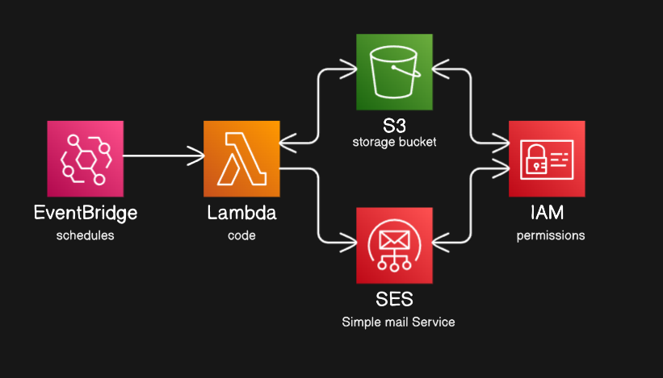
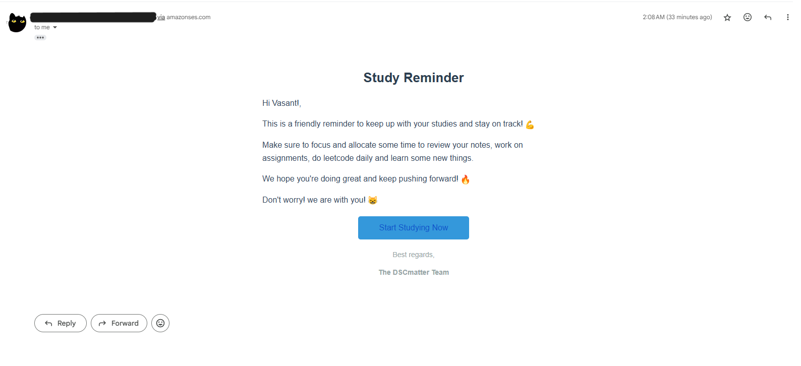

# AWS-Serverless-Email-Marketing

This project is a **serverless email marketing system** built using AWS services. It enables automated email campaigns using **Amazon S3, SES, Lambda, and EventBridge**.

## 🚀 Features

- 📂 **Store email templates & contacts** in **Amazon S3**.
- ✉️ **Send emails** using **Amazon Simple Email Service (SES)**.
- 🔄 **Merge templates with contacts** and trigger email sending via **AWS Lambda**.
- ⏰ **Schedule automated emails** using **Amazon EventBridge**.

## 🛠️ AWS Services Used

- **Amazon S3** – Stores email templates and contact lists.
- **Amazon SES** – Sends emails.
- **AWS Lambda** – Processes and merges email templates with contact data.
- **Amazon EventBridge** – Triggers scheduled email campaigns.
- **AWS IAM** – Manages permissions and security.

## 📌 Architecture Overview

1. Upload email templates (HTML) and contact lists (CSV) to an **S3 bucket**.
2. A **Lambda function** reads the email template and contacts.
3. The function sends personalized emails using **SES**.
4. **EventBridge** triggers the Lambda function on a schedule.

## 🏗️ Setup Instructions

### 1️⃣ Configure Amazon S3
- Create an S3 bucket.
- Upload email templates (HTML).
- Upload contact lists (CSV).

### 2️⃣ Set Up Amazon SES
- Verify an email address and domain.
- Move SES out of the sandbox (optional for production).

### 3️⃣ Create AWS Lambda Function
- A Python function to read S3 files and send emails via SES.
- Ensure Lambda has **S3 read** and **SES send** permissions.

### 4️⃣ Configure Amazon EventBridge
- Create a rule to invoke Lambda on a schedule.

## 🔍 Testing & Debugging
- **Test SES** by sending emails manually.
- **Validate Lambda** permissions for S3 and SES.
- **Monitor logs** using AWS CloudWatch.

## 🚀 Deployment
- Use AWS SAM or Terraform for IaC (optional).
- Secure IAM roles to restrict access.

## Example: 

---

> [!IMPORTANT]  ⚠️ Remember to delete unused AWS resources to avoid unnecessary charges!
